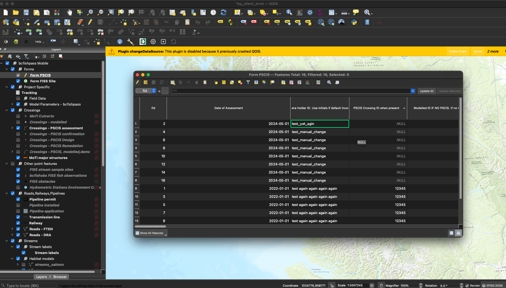
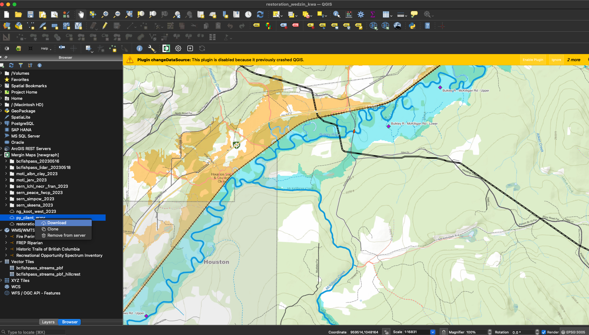

```{r setup, echo=TRUE, include = TRUE}
knitr::opts_chunk$set(echo=TRUE, message=FALSE, warning=FALSE, dpi=60, out.width = "100%", eval = TRUE)
options(scipen=999)
options(knitr.kable.NA = '--') #'--'
options(knitr.kable.NAN = '--')


# load our package
library(reticulate)
```

# Make an Issue
Let's make an issue to document what we are doing.  We turn this chunk off because it is a one time call.

```{r issue010, eval = FALSE}
output_issue_create <- gh::gh(
  endpoint = "POST /repos/{owner}/{repo}/issues",
  title = "`mergin-client` error when changes made to geopackages",
  body = "Seems to be occurring with programatic and `QGIS` by-hand changes to files.",
  owner = params$repo_owner,
  repo = params$repo_name,
  assignee = params$repo_owner
)

# lets add labels
gh::gh(
  endpoint = "POST /repos/{owner}/{repo}/issues/{issue_number}/labels",
  labels = c("QGIS", "mergin", "documentation"),
  owner = params$repo_owner,
  repo = params$repo_name,
  issue_number = output_issue_create$number
)

output_issue_create$number
```

Here is the issue number though captured from above:

```
output_issue_create$number
```

>[1] 166


# Create Fresh QGIS Project

Ok. This is a brand new project!

I created it on the command line and pushed it to the server with:

```         
mergin create newgraph/py_client_error --from-dir ~/Projects/gis/py_client_error
```

Then we want to start fresh - delete the project locally and then download to our local machine.
We could use `system2` calls to our already existing `conda` environment like below which seems to work just fine as so...

```{r}
# first we remove the file
system2("rm", args = c("-rf", "/Users/airvine/Projects/gis/py_client_error"))

# now we download
system2('conda', args = c('run', '-n', 'dff2', 'mergin download newgraph/py_client_error /Users/airvine/Projects/gis/py_client_error'), stdout = TRUE)
```
# Use `reticulate` to install `python` and set up `virtual environment`
But... We want to move to using python directly in Rstudio (helps for story telling and reproducability) with `reticulate` So we installed python fresh with:

```         
reticulate::install_python()
```

And now:

```{r}
reticulate::virtualenv_starter(all = TRUE)
```
## Install  `mergin-client` package in the `virtual environment`
So do a one time move and make a `py_env` called `test` and install the `mergin-client` package

```         
reticulate::virtualenv_create("test")

reticulate::virtualenv_install("test", "mergin-client")
```

Now lets indicate we want to use it

```{r}
reticulate::use_virtualenv("test", required = TRUE)

```

## Import `mergin` module and create a client instance

1.  Import the `mergin` module:

```{r}
mergin <- import("mergin")
```

2.  Create an instance of mergin-client with the specified login credentials.

```{r}
# Create a Mergin client instance with your credentials
client <- mergin$MerginClient(login = Sys.getenv("MERGIN_USERNAME"), password = Sys.getenv("MERGIN_PASSWORD"))


```

3.  Remove the project and create it again

```{r}
system2("rm", args = c("-rf", "/Users/airvine/Projects/gis/py_client_error"))


# Download a project using the client instance
client$download_project('newgraph/py_client_error', '/Users/airvine/Projects/gis/py_client_error')

```

## Review the methods and attributes of the module and client instance

Whoa - awesome. Let's have a look at all the available

```{r}
# List attributes and methods of the module or client instance
module_methods <- py_list_attributes(mergin)
client_methods <- py_list_attributes(client)

# Print the lists
print("Methods and attributes of the module:")
print(module_methods)

print("Methods and attributes of the client instance:")
print(client_methods)
```

Sick.

## Get help on a specific method. Opens in new window which is a bit odd IMO. We will turn this chunk off to avoid clicking the closed.

```{r, eval = FALSE}
# Get help on a specific method
py_help(client$download_project)
py_help(client$project_info)
py_help(client$push_project)
```

Let's get some info about the project.

```{r}
project_info <- client$project_info('newgraph/py_client_error')

```

Lot's here. for instance

```{r}
names(project_info)
```

# Use `processx` package and `mergin-client` commandline tool and current `conda` environment to check the status

`mergin status` is not an obvious call with the python module raw so we will use the `mergin-client` installed with `conda`. We will probably move away from `conda` soon and straight to `venv` so not getting into the `conda` specifics.  We do havetwo `conda` environments installed (latest one yesterday) and they are created using the `environment.yml` files in 
`r knitr::asis_output(params$repo_url)` as per the `readme` at `r knitr::asis_output(paste0(params$repo_url, "tree/master/scripts/qgis"))`.

<br>

system2` was really tricky to try to run outside of the `workng directory` so we are going to try out `processx`.

<br>

Let's check the status of our project. First we make a function for our `processx` call.

```{r}
library(processx)

# Define the command and working directory
command <- "conda"
args <- c('run', '-n', 'dff2', 'mergin', 'status')
working_directory <- "/Users/airvine/Projects/gis/py_client_error"

mergin_call <- function(){
  result <- tryCatch({
    run(
      command,
      args = args,
      echo = TRUE,            # Print the command output live
      wd = working_directory, # Set the working directory
      spinner = TRUE,         # Show a spinner
      timeout = 60            # Timeout after 60 seconds
    )
  }, error = function(e) {
    # Handle errors: e.g., print a custom error message
    cat("An error occurred: ", e$message, "\n")
    NULL  # Return NULL or another appropriate value
  })
  
  # Check if the command was successful
  if (!is.null(result)) {
    cat("Exit status:", result$status, "\n")
    cat("Output:\n", result$stdout)
  } else {
    cat("Failed to execute the command properly.\n")
  }
}

```


```{r}

result <- mergin_call()
```

Now let's add a file to the project and check the status again

```{r}
# Create a new file in the project directory
# to make reporoduable we will use a random number between 1:10000 appended

file_name <- paste0("/Users/airvine/Projects/gis/py_client_error/test_", sample(1:10000, 1), ".txt")
system2("touch", args = c(file_name))

result <- mergin_call()
```

Now we make a change to `form_pscis.gpkg` programatically with R.

```{r}

# sf::st_layers(paste0(working_directory, "/form_pscis.gpkg"))
form_in <- sf::st_read(paste0(working_directory, "/form_pscis.gpkg"))

# this is adding rows to the table 
form_in |> 
  dplyr::mutate(my_crossing_reference = sample(1:10000, 1)) |> 
  sf::st_write(paste0(working_directory, "/form_pscis.gpkg"), "form_pscis", append = FALSE)

```

Now we check the status again.

```{r}
# Execute the command using processx::run within tryCatch
result <- mergin_call()

```

Really weird. This was all good the first time I ran it.  Now it throws an error. We should look closer at the changes in that file.

# Push Changes to Server

Let's push the changes to the server.  Doesn't matter if it wouldn't let us see the status....

```{r}
client$push_project('/Users/airvine/Projects/gis/py_client_error')

# client$pull_project('/Users/airvine/Projects/gis/py_client_error')

```

Now we check the status again.

```{r}
# Execute the command using processx::run within tryCatch
result <- mergin_call()

```

That seems to clear everything up... Why? Why does it need to be pushed for the status to work?  Guessing that it is because reading in the file and making changes in `R` alters the `schema` of the `geopackage` somehow and `geodiff` cannot properly track it so throws the `segmentation` error.  

<br>

Let's quickly visualize the differences in the file before and after our change. This is all within R - with the table as a `sf` object so is not telling us the difference in things like column types between `QGIS` and `R`.

<br>

Hmm.  Let's just test to see if even reading it and burning it back to file `updated` will cause the error. We don't actually even read it into an `sf` object

<br>

```{r}
sf::st_read(paste0(working_directory, "/form_pscis.gpkg")) |> 
  sf::st_write(paste0(working_directory, "/form_pscis.gpkg"), "form_pscis", update = TRUE)
```

```{r}
result <- mergin_call()
```
Ok.  Looks like that is *maybe* the culprit. Let's visualize the differences if we can.

## Visualize Differences in `geopackage` file and `sf` object

Here is the `gpkg` in QGIS.

```{r, echo=FALSE}

library(jsonify)
library(purrr)
library(tibble)


gpkp_q <- jsonify::from_json(
  sf::gdal_utils("ogrinfo", paste0(working_directory, "/form_pscis.gpkg"), options = c("-json"))
)

gpkp_q_sum <- purrr::map2_dfr(
  gpkp_q$layers$fields$name, 
  gpkp_q$layers$fields$type, 
  ~tibble::tibble(name = .x, type = .y))

fpr::fpr_kable(gpkp_q_sum, font = params$font_set)
```

Here is gpkg columns and types in `R`

```{r}
gpkp_r <- sf::st_read(paste0(working_directory, "/form_pscis.gpkg"))

# maek tibble of colun names and class
gpkp_r_sum <- purrr::map2_dfr(
  names(gpkp_r), 
  sapply(gpkp_r, function(col) class(col)[1]), 
  ~tibble::tibble(name = .x, type = .y)
)

fpr::fpr_kable(gpkp_r_sum, font = params$font_set)

```


Let's compare the differences:
```{r}
identical(gpkp_q_sum, gpkp_r_sum)

waldo::compare(gpkp_q_sum, gpkp_r_sum)

```

## Summary

Ok.  Seems perhaps reasonable that we get some discontinuity with modifications in `R`. We do have systems to track changes with git and `csvs`. Clunky but they do work somewhat (I think).

# Modify geopackage table in QGIS by hand.

What about if we do something by hand? That should be fine and `geodiff` should be able to track. 


First let's remove the project again and redownload to confirm our status is all good

```{r}
system2("rm", args = c("-rf", "/Users/airvine/Projects/gis/py_client_error"))

# now we download
system2('conda', args = c('run', '-n', 'dff2', 'mergin download newgraph/py_client_error /Users/airvine/Projects/gis/py_client_error'), stdout = TRUE)

# check status
result <- mergin_call()
```

We opened the project in QGIS and make a change to the `form_pscis` table "by hand". See screenshot.

```{r}
# append scripts/qgis/mergin/ to the front would make snese...


```

Then we checked the status again.

```{r}
result <- mergin_call()

```

Ok.  So I don't think we have a problem with `R` and types.  As interesting as all that is - it seems that even a
manual change in the gpkg triggers an error.  We will have to look into this further.  

TO DO:

Test if altering the gpkg by hand throws error if the file was never read into R.....  There could be corruptions
in the file history over time that trigger error with `geodiff` every time there is a change.....

# Test `py-api-client v0.8.3`

Let's have a look at what happens if we try to check the status with the `py-api-client v0.8.3` version.

```{r}
# Define the command and working directory
args <- c('run', '-n', 'dff', 'mergin', 'status')

result <- mergin_call()
```

```{r}
args <- c('run', '-n', 'dff', 'mergin', 'push')
result <- mergin_call()

```

We can't push!!

**Looks like things have improved! Nice work ninjas!!** ⚔️


# Download Project with QGIS plugin
Let's try one last thing. We are going to download the file with the QGIS plugin, make a change to the `form_pscis` table and then check the status again.

<br>

First we remove the project.

```{r, eval = FALSE}
# turned off - remove the project
system2("rm", args = c("-rf", "/Users/airvine/Projects/gis/py_client_error"))

```

Then we download the project with the QGIS plugin.

```{r}
# Download the project with the QGIS plugin
# oddly seems we neeed to run from here vs with scripts/qgis/mergin/ at the front. don't get it


```         

Check the status with v0.9.0 again 

```{r}
args <- c('run', '-n', 'dff2', 'mergin', 'status')

result <- mergin_call()

```


Now we make a trivial change with R - same as before.

```{r}
form_in <- sf::st_read(paste0(working_directory, "/form_pscis.gpkg"))

form_in |> 
  dplyr::mutate(my_crossing_reference = sample(1:10000, 1)) |> 
  sf::st_write(paste0(working_directory, "/form_pscis.gpkg"), delete_dsn = TRUE)
```

Check the status again.

```{r}

args <- c('run', '-n', 'dff2', 'mergin', 'status')
result <- mergin_call()


```

This is the captured output from the terminal. There is more with `processx` but that is not relevant I don't think. 

```
/var/folders/mg/h910y2c54fsc99qj74dyrjph0000gn/T/tmp6qsmgvr7: line 3: 82287 Segmentation fault: 11  mergin status

ERROR conda.cli.main_run:execute(124): `conda run mergin status` failed. (See above for error)
```

AHA!! It seemed like it was the QGIS plugin.  But our results were inconsistent. Crazy. Not sure what is going on.

# Push Changes to Server
This is interesting too though.. We can still push and pull no problem.

```{r eval = FALSE}
args <- c('run', '-n', 'dff2', 'mergin', 'push')

result <- run(
  command,
  args = args,
  echo = TRUE,            # Print the command output live (similar to stdout = TRUE in system2)
  wd = working_directory, # Set the working directory
  spinner = TRUE,         # Show a spinner in the R console while the command runs
  timeout = 60            # Set a timeout for the command to complete
)

```

Let's get the chunk ready to do our commits of these files to address our issue.  We turn it off though.


```{r git010, eval=FALSE}
# we need to derive the properpath to the file for git to see it
path_file_out <- paste0(
    tools::file_path_sans_ext(params$file_in),
  '.html'
)

gert::git_add(
  c(params$file_in, path_file_out)
)

message <- "initial commit file to address #166"
message <- "update file to address #166 by includeing git commits"

gert::git_commit(message)

gert::git_push()
```

We can read our docs online so lets add a comment in the issue that points to the file:

```{r issue020, eval = FALSE}

# construct the url of the viewer
url_viewer <- paste0(
  "http://htmlpreview.github.io/?",
  params$repo_url,
  "blob/",
  params$repo_branch,
  "/",
  path_file_out
)

gh::gh(endpoint = "POST /repos/{owner}/{repo}/issues/{issue_number}/comments",
       body = paste0("The documentation for this is available here ", url_viewer, " ."),
       owner = params$repo_owner,
       repo = params$repo_name,
       issue_number = 166
)
```


```{r render, eval = FALSE}
rmarkdown::render(input = params$file_in, output_file = params$file_out)
```
